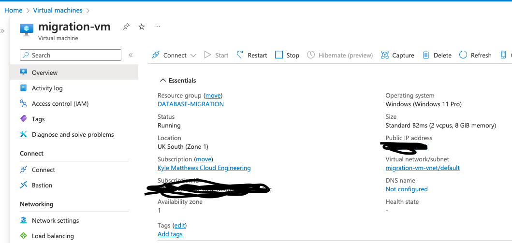
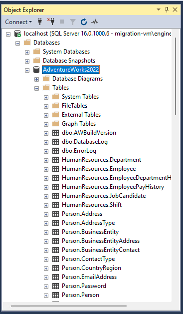
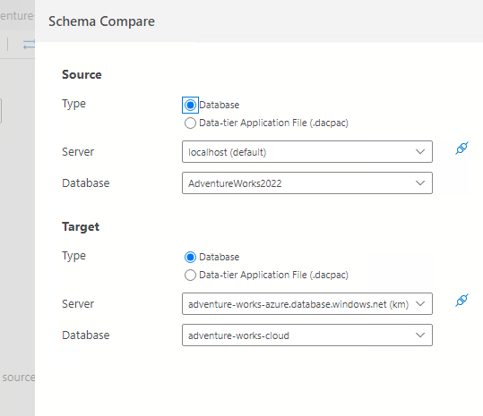
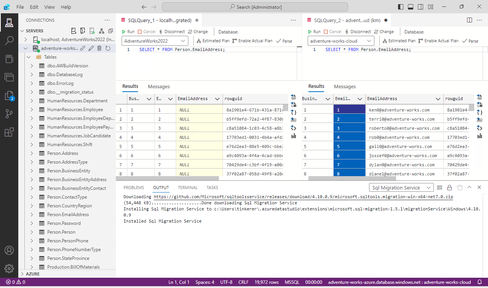
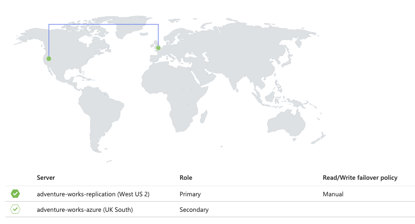
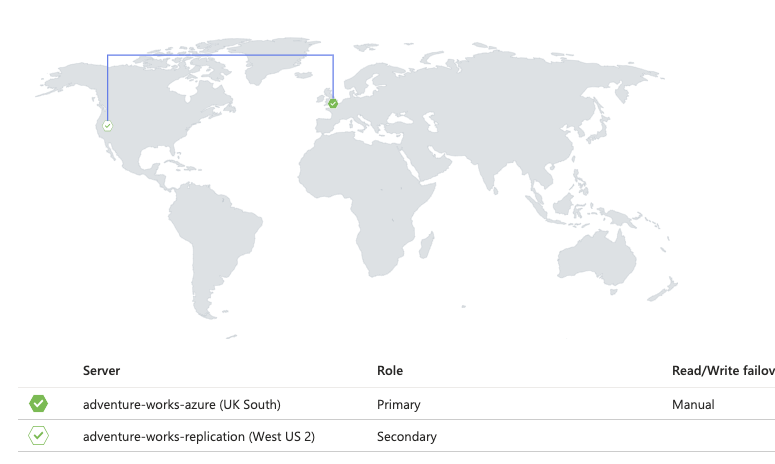

# Azure Database Migration
*By Kyle Matthews*

 

#### In-project noise provided by: 

## Introduction

For this project I am going to architect and implement a cloud-based database for a manufactoring company's global operations. I will begin by establishing a database from a saved backup before migrating it to an Azure cloud-based database. As part of this project I will be focussing on crucial aspects of cloud and database engineering: data backup, automated scheduling and restoration. 
Once the database is established and working to a high standard, I will be simulating a disaster scenario that could encompass data loss. Furthermore I will be exploring the complexities of geo-replication and failover configurations to ensure data availablity under adverse conditions. 
Finally, to enhance database security I will be employing Microsoft Entra ID integration to define access roles, which will add an extra layer of control and protection to the cloud-based database. 
The following sections of this `README` will be a documentation the steps I take in order to achieve the final goal of the project. 

## Contents
1. [Virtual Machine Set-up](#step-1-setting-up-the-virtual-machine)
2. [Creation of Production Database](#step-2-creation-of-the-production-database)
3. [Setting up the Azure Database](#step-3-setting-up-the-azure-database)
4. [Data Migration](#step-4-data-migration)
5. [Data Backup and Restore](#step-5-data-backup-and-restore)
6. [Disaster Recovery Simulation](#step-6-disaster-recovery-simulation)
7. [Geo-Replication and Failover](#step-7-geo-replication-and-failover)
8. [Microsoft Entra Directory Integration](#step-8-microsoft-entra-directory-integration)

## Step 1: Setting up the Virtual Machine
In order to create a safe workspace to develop the database I have utilised Azure's virtual machine capabilities, this means that I have a non-physical operating system in which to build and test the database. The virtual machine is scalable to the needs of the company and database and it will be readily avaialable with minimal downtime. Configuring the virtual machine was rather straightforward; using a `standard_b2ms` system named `migration-vm`. Once it was accessable through Microsoft Remote Desktop I began installing the tools that I needed in order to make this project a success. 

The `B-series` virtual machine was chosen as this database would not require the full performance of the CPU continuously. Another benefit of the `B-series` burstable VM, is that it can bank credits during low usage hours, which can then be re-deployed during times where the machine may need to work above its baseline. Another advantage to using an Azure virtual machine is that it offers scalability so that infrastructure can be scaled up or down, depending on the business needs.  

For this virtual machine it was decided that a Windows 11 image would be the best choice as it offers a GUI that would make maintenence work much more user friendly than a Linux machine. In addition to this, it also means that employees can connect to the VM using a `.RDP` in Microsoft Remote Desktop rather than connecting via SSH and having to configure a GUI in the Linux Terminal. 

[Back to Contents](#contents)

## Step 2: Creation of the Production Database
For this stage I opted to download the database to a local machine but I have also saved a copy in the `adventurebackup` storage account as a precautionary measure. Using the `.bak` to restore the database in SMSS was rather straightforward, and at the moment it is being hosted on the `migration-vm` virtual machine. 

SQL Server Management Studio (SMSS) is the program that I have chosen to use to configure and manage the restored backup of the adventure works database. I will also be using SMSS to automate administrative tasks such as scheduled database back-up.

[Back to Contents](#contents)

## Step 3: Setting up the Azure Database
I began by creating a new database server called `adventure-works-azure`, I thought this would be a suitable solution as it would provide Adventure Works with their own dedicated server, should they ever expand or require additional databases. Within this server I created the `adventure-works-cloud` database where the data was going to be migrated to. 
As a security measure I have only allowed connections from my IP address to access the database, all other public IP's are denied access. 

[Back to Contents](#contents)

## Step 4: Data Migration
After configuring the database it was time to begin the migration process. The first thing I did was compare the database schemas in `Azure Data Studio` using `SQL Schema Compare v1.21.0`. 

Schema compare is an integral part of the migration process as it confirms whether or not the schema of the local database (`adventurebackup`) is compatible with the cloud-based database's (`adventure-works-could`)schema. This is one of the steps taken to help prevent any data-loss that could arise from an incomplete migratiion. 

(Please excuse the terminal icon being superimposed over the top of everything. This Macbook I'm using is over 10 years old and a little bit shonky).

Thankfully, the extension decided the schemas were compatible and as a result the migration process was fairly smooth. Using the `Azure Migration v1.5.1` extension I was able to migrate the database to the cloud.
As part of this process I had to download `Microsoft Integration Runtime` and configure it using an authentication key in order to make the migration happen. 

[Back to Contents](#contents)

## Step 5: Data Backup and Restore
For the next part of the project I created another Virtual Machine that I will be using to create a safety net for the original database incase of any unforeseen issues. Initially the backup was saved to the local machine but in order to add an extra layer of security a copy of the `.bak` file was uploaded to the `adventurebackup` storage account. 
Finally, for best practice the access keys for `adventurebackup` were saved as the credential `backupbarry` (similar to Wreck-it-Ralph) so that an automated backup schedule could be created. The Database now automatically creates backups at midnight every Sunday, a time when the database should be under a very low load. 

[Back to Contents](#contents)

## Step 6: Disaster Recovery Simulation 
During this phase of the project I simulated data corruption within the database by creating a query that set a number values in `Person.EmailAddress` to `NULL`. 

In order to restore the lost data I had to restore the database from a pervious backup. In this situation it was imperative that I sourced the backup from the closest possible time to the corruption of the data in order to maintain best practices.

[Back to Contents](#contents)

## Step 7: Geo-Replication and Failover
In order to enhance the reliability and data protection of the database server, I have configured a Geo-replication of the restored `adventure-works-cloud` database.
For security it is based on a new server called `adventure-works-failover` and it is based on the West of the USA. This strategy protects data availablity and minimises disruption or downtime that could be costly (financially or legally) to a company. 

The above image demonstrates the failover-tests success, as the UK South based server `adventure-works-cloud` is detected as being down, the `adventure-works-replication` steps up to become the primary server, temporarily demoting the usual Primary server to secondary. 

The failover process is cyclical, and as a result the above image shows what happens when an outage occurs on the USA server. The servers revert back ot their original configuration. 

[Back to Contents](#contents)

## Step 8: Microsoft Entra Directory Integration

For this part of the project I will be integrating Microsoft Entra Directory into the `adventure-works-azure` server to introduce a more organised way to manage who can access the production database. 

First I went to `adventure-works-azure` where the `adventure-works-cloud` database is stored. As lead engineer on the database (and in this case, the sole engineer!) I had already configured my user account to have admin priveledges. 
Then, using my `migration-vm` I connected to `adventure-works-cloud` with EntraID authentication. 
Back in Azure, I went to the entraID homepage and created a new user who would be given read-only access to the database to minimise the risk of data loss. In order to achieve this goal, this new user would be granted the `db_reader` role. 
On `migration-vm` which was still connected to entraID, I ran the following query on the `adventure-works-cloud` database: 

`CREATE USER [DB_Reader@***.com] FROM EXTERNAL PROVIDER; ALTER ROLE db_datareader ADD MEMBER [DB_Reader@***.com];`

In order to test that the user had the correct access a password needed to be set on the first login and then I verified that the `db_reader` could not edit the database tables.

[Back to Contents](#contents)